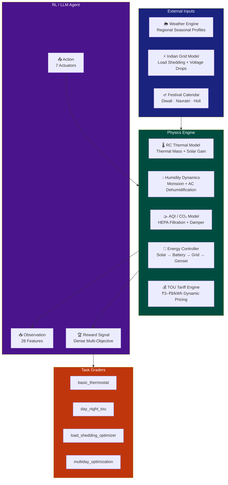
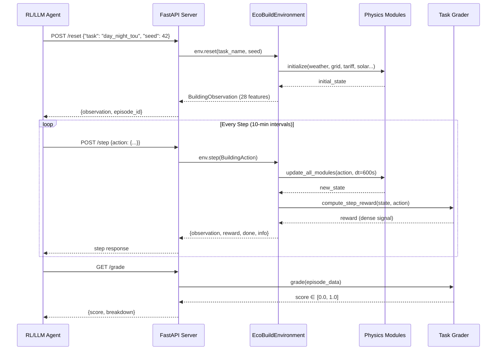
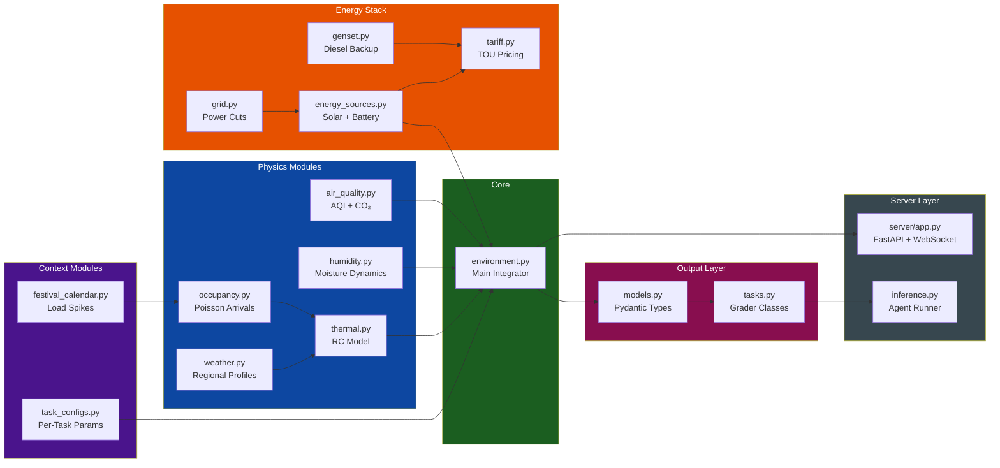
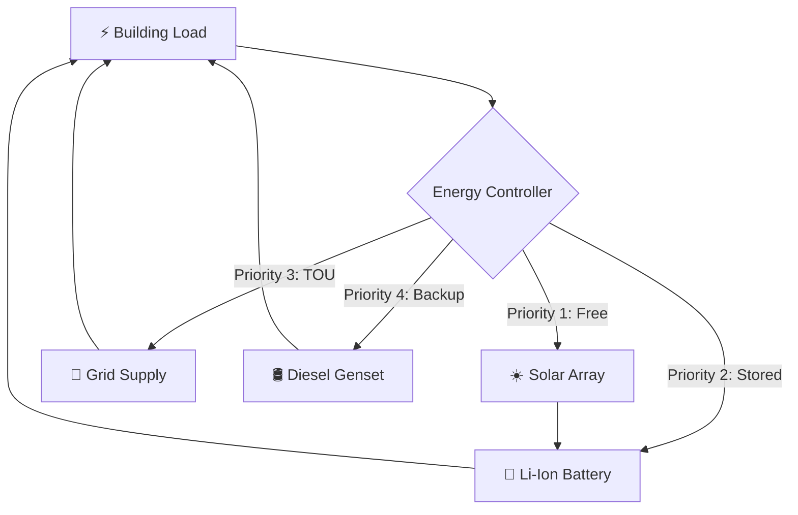
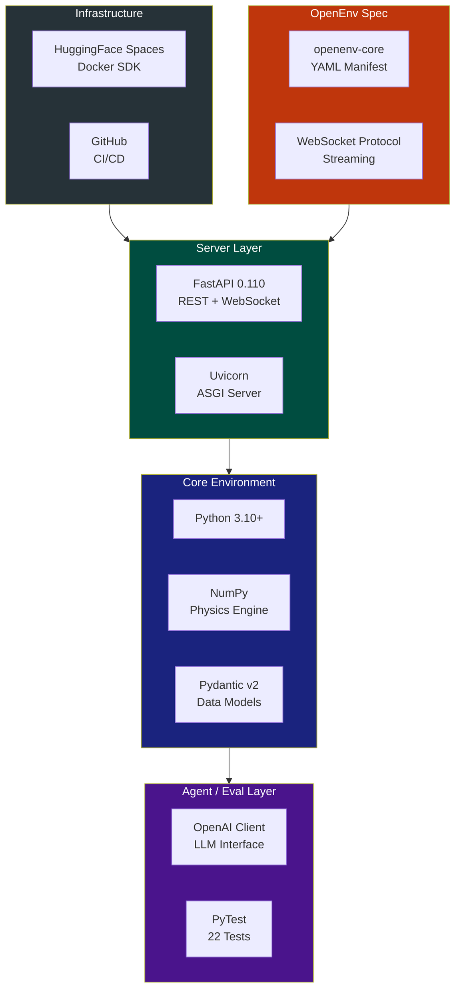
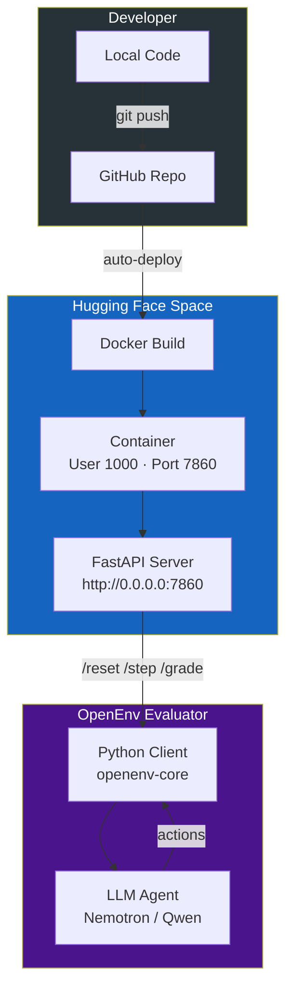
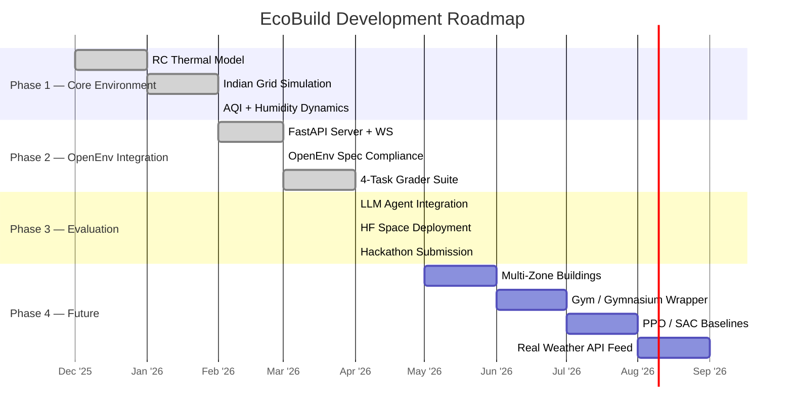
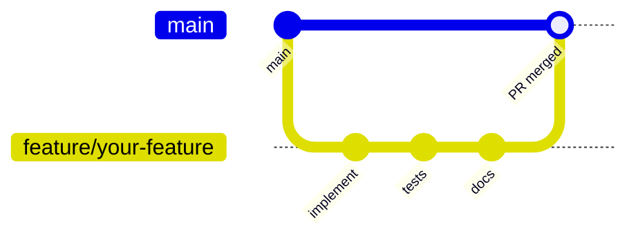

<div align="center">

# EcoBuild

**Production-Grade Smart Building Energy Management · OpenEnv RL Environment**

[](https://github.com/meta-pytorch/OpenEnv)
[](https://python.org)
[](https://fastapi.tiangolo.com)
[](https://docker.com)
[](https://huggingface.co/spaces/mahimajain19/ecobuild-energy-env)
[](LICENSE)
[](tests/)

<br/>

*The most realistic Indian smart building RL environment ever built.*  
*Agents must navigate load shedding, monsoon humidity, AQI crises, TOU tariffs, and festival spikes — all at once.*

<br/>

**[Live Space →](https://huggingface.co/spaces/mahimajain19/ecobuild-energy-env)** &nbsp;|&nbsp; **[API Docs →](#api-documentation)** &nbsp;|&nbsp; **[Quickstart →](#installation--quickstart)**

</div>

---

## The Problem

Existing RL benchmarks for building energy management are built for Western infrastructure — stable grids, mild seasons, and simple HVAC. **They fail completely when applied to 70% of the world.**

India alone has:
- **1.4 billion people** living with unreliable power grids
- **₹2.4 trillion** annual spend on building energy — largely unoptimised
- **Load shedding**: Tier-2 cities face up to 8 hours of outages per day
- **AQI crises**: Delhi winters routinely hit 400–500 AQI (Hazardous)
- **Extreme thermal delta**: 45°C summers to 4°C winters in the same city

No open benchmark exists that captures this complexity. **EcoBuild fills that gap.**

---

## Solution Overview

EcoBuild is a multi-physics RL environment that faithfully simulates a commercial building operating under Indian conditions. It integrates 11 interacting physics modules, exposes a fully OpenEnv-compliant REST/WebSocket API, and ships with 4 calibrated evaluation tasks.



---

## System Architecture

### Full Component Interaction



### Module Dependency Graph



---

## Core Features

<table>
<tr>
<td width="50%">

### RC Thermal Model
Physics-based Resistor-Capacitor heating/cooling model. Thermal mass (capacitance) means temperature changes take time — an agent must **pre-heat before occupancy**, not react after.

```
ΔT = (1/C) × [UA(T_out−T_in)
     + P_heater − P_AC
     + P_solar_gain
     + P_occupants] × dt
```

</td>
<td width="50%">

### Indian Grid Load Shedding

Scheduled + stochastic power cuts based on Tier-1/Tier-2 city profiles. Voltage drops and frequency deviations damage equipment modeled via economic penalties.

```mermaid
gantt
    title Sample Mumbai Grid Day
    dateFormat HH
    axisFormat %H:00
    section Grid
    Active          :done, 00, 6h
    Power Cut       :crit, 06, 2h
    Active          :done, 08, 8h
    Power Cut       :crit, 16, 3h
    Active          :done, 19, 5h
```



</td>
</tr>
<tr>
<td width="50%">

### Tri-Source Energy Dispatch

Intelligent dispatch between 4 energy sources via a priority-based controller:



</td>
<td width="50%">

### AQI / CO₂ Trade-off

A uniquely Indian constraint: fresh air dampers reduce indoor CO₂ but let in hazardous outdoor PM2.5 during smog events. The agent must arbitrate:

| Damper | CO₂ Effect | AQI Effect |
|--------|-----------|-----------|
| Closed | ↑ Builds up | ✅ Filters out |
| 15% | ↓ Slight drop | ↑ Slight intake |
| 50% | ↓↓ Good flush | ↑↑ Moderate |
| 100% | ✅ Full fresh | ⚠️ High intake |

</td>
</tr>
<tr>
<td width="50%">

### Festival Calendar

Major Indian festivals trigger precise occupancy and lighting multipliers — predictable events an intelligent agent should learn to anticipate:

| Festival | Month | Occ. Mult | Light Mult |
|---------|-------|-----------|-----------|
| Holi | March | 1.8× | 2.2× |
| Diwali | Oct–Nov | 2.1× | 3.5× |
| Navratri | Oct | 1.6× | 2.0× |
| Eid-ul-Fitr | Apr | 1.4× | 1.5× |

</td>
<td width="50%">

### Multi-Objective Reward Shaping

Dense step-level reward signals that guide agents immediately, not just at episode end:

```python
reward = (
  - comfort_penalty      # °C outside [T_min, T_max]
  - energy_cost_inr      # ₹ per 10-min interval
  - aqi_penalty          # PM2.5 exposure cost
  - humidity_penalty     # >70% or <30% discomfort
  - genset_cost_extra    # diesel premium cost
  + solar_utilization    # bonus for free energy use
)
```

</td>
</tr>
</table>

---

## Task Suite


### Grading Breakdown

<details>
<summary><strong>Task 1 — basic_thermostat</strong> (click to expand)</summary>

```
score = 0.40 × comfort_score
      + 0.40 × energy_efficiency
      + 0.20 × vacancy_score

comfort_score     = % occupied steps where temp ∈ [20, 22]°C
energy_efficiency = max(0, 1 - energy_used / always_on_baseline)
vacancy_score     = % unoccupied steps where heater AND lights = OFF
```
</details>

<details>
<summary><strong>Task 2 — day_night_tou</strong></summary>

```
score = 0.30 × cost_efficiency
      + 0.30 × comfort_score
      + 0.25 × tou_awareness
      + 0.15 × vacancy_score

tou_awareness = low ₹/kWh ratio → shifted loads to off-peak
```
</details>

<details>
<summary><strong>Task 3 — load_shedding_optimizer</strong></summary>

```
score = 0.40 × comfort_during_cuts
      + 0.30 × genset_cost_score
      + 0.30 × pre_conditioning_score

pre_conditioning = temp within ±0.5°C of target before each outage
```
</details>

<details>
<summary><strong>Task 4 — multiday_optimization</strong></summary>

```
score = 0.30 × cost_score
      + 0.30 × comfort_score
      + 0.20 × co2_score
      + 0.10 × anticipation_score
      + 0.10 × constraint_free_score
```
</details>

---

## API Documentation

### Endpoints

| Method | Endpoint | Description |
|--------|----------|-------------|
| `POST` | `/reset` | Start a new episode |
| `POST` | `/step` | Submit an action, receive observation |
| `GET` | `/state` | Get current environment state |
| `GET` | `/grade` | Get final episode score |
| `GET` | `/tasks` | List available tasks |
| `GET` | `/health` | Health check |
| `WS`  | `/ws` | WebSocket streaming interface |

### Sample: Reset

```bash
curl -X POST https://mahimajain19-ecobuild-energy-env.hf.space/reset \
  -H "Content-Type: application/json" \
  -d '{"task_name": "day_night_tou", "seed": 42}'
```

```json
{
  "episode_id": "ep-a3f2c1",
  "task_name": "day_night_tou",
  "observation": {
    "indoor_temperature": 28.4,
    "outdoor_temperature": 38.1,
    "humidity": 52.3,
    "occupancy_count": 0,
    "grid_available": true,
    "grid_voltage": 228.5,
    "electricity_price_normalized": 0.375,
    "solar_generation_kw": 3.2,
    "battery_soc_pct": 68.0,
    "outdoor_aqi": 87.0,
    "indoor_co2_ppm": 412.0,
    "hour_of_day": 6,
    "predicted_occupancy_2h": 12,
    "predicted_next_cut_minutes": 480
  }
}
```

### Sample: Step

```bash
curl -X POST https://mahimajain19-ecobuild-energy-env.hf.space/step \
  -H "Content-Type: application/json" \
  -d '{
    "heater_control": 0,
    "ac_control": 1,
    "lights_control": 0,
    "fan_speed": 1,
    "fresh_air_damper": 1,
    "genset_control": 0,
    "battery_charge_rate": 0
  }'
```

```json
{
  "observation": { "...": "updated 28-feature state" },
  "reward": -0.42,
  "done": false,
  "info": {
    "total_cost_inr": 1.24,
    "energy_kwh": 0.31,
    "co2_kg": 0.25,
    "comfort_violation": false
  }
}
```

---

## Observation & Action Space

### Observation Space (28 Features)

| Category | Feature | Type | Range | Description |
|----------|---------|------|-------|-------------|
| Thermal | `indoor_temperature` | float | 0–50°C | Current indoor air temperature |
| Thermal | `outdoor_temperature` | float | -5–50°C | Outdoor ambient temperature |
| Thermal | `humidity` | float | 10–100% | Indoor relative humidity |
| Air | `outdoor_aqi` | float | 0–500 | Outdoor PM2.5 AQI index |
| Air | `indoor_co2_ppm` | float | 300–5000 | Indoor CO₂ concentration |
| Energy | `solar_generation_kw` | float | 0–15 kW | Current rooftop solar output |
| Energy | `battery_soc_pct` | float | 0–100% | Battery state of charge |
| Energy | `genset_fuel_pct` | float | 0–100% | Diesel genset fuel remaining |
| Grid | `grid_available` | bool | 0/1 | Is grid power currently on? |
| Grid | `grid_voltage` | float | 180–250V | Current supply voltage |
| Grid | `predicted_next_cut_minutes` | float | 0–480 | Estimated minutes to next outage |
| Grid | `electricity_price_normalized` | float | 0–1 | Normalized current ₹/kWh |
| Occupancy | `occupancy_count` | int | 0–50 | Current number of occupants |
| Occupancy | `predicted_occupancy_2h` | int | 0–50 | Predicted occupants in 2 hours |
| Time | `hour_of_day` | int | 0–23 | Current hour |
| Time | `day_of_week` | int | 0–6 | Day of week |
| Festival | `festival_occupancy_mult` | float | 1.0–3.5 | Festival occupancy multiplier |

### Action Space (7 Actuators)

| Actuator | Type | Values | Description |
|----------|------|--------|-------------|
| `heater_control` | Binary | 0, 1 | Electric heater on/off |
| `ac_control` | Binary | 0, 1 | Air conditioner on/off |
| `lights_control` | Binary | 0, 1 | Lighting on/off |
| `fan_speed` | Discrete | 0, 1, 2 | HVAC fan: off, low, high |
| `fresh_air_damper` | Discrete | 0, 1, 2, 3 | Damper: closed, 15%, 50%, 100% |
| `genset_control` | Binary | 0, 1 | Diesel genset manual override |
| `battery_charge_rate` | Discrete | 0, 1, 2 | Battery: auto, force charge, force discharge |

---

## Tech Stack



---

## Folder Structure

```
ecobuild/
│
├── ecobuild_env/               # Core simulation package
│   ├── __init__.py             # Public API exports
│   ├── environment.py          # Main environment integrator (554 lines)
│   ├── models.py               # Pydantic data models (Observation, Action, State)
│   ├── tasks.py                # Task grader classes (4 graders)
│   ├── task_configs.py         # Per-task configuration registry
│   │
│   ├── thermal.py              # RC Thermal model (heat capacity, solar gain)
│   ├── weather.py              # Indian regional seasonal weather profiles
│   ├── occupancy.py            # Poisson arrival/departure stochastic model
│   ├── humidity.py             # Moisture dynamics + AC dehumidification
│   ├── air_quality.py          # AQI / PM2.5 / CO₂ + HEPA filtration
│   │
│   ├── grid.py                 # Load shedding + voltage fluctuation model
│   ├── tariff.py               # Indian TOU electricity pricing (DISCOM)
│   ├── energy_sources.py       # Solar array + Li-ion battery controller
│   ├── genset.py               # Diesel genset economics + fuel tracking
│   ├── festival_calendar.py    # Indian festival load multipliers
│   └── client.py               # OpenEnv-compliant client (openenv-core)
│
├── server/
│   └── app.py                  # FastAPI server (REST + WebSocket)
│
├── tests/                      # Pytest test suite (22 tests)
│   ├── test_environment.py
│   ├── test_graders.py
│   ├── test_grid.py
│   └── test_physics.py
│
├── outputs/
│   └── evals/                  # Inference results (JSON per episode)
│
├── inference.py                # LLM + baseline agent runner (root — required)
├── openenv.yaml                # OpenEnv framework manifest
├── scenario_config.json        # Runtime configuration
├── Dockerfile                  # HF Spaces compliant (user 1000, port 7860)
├── requirements.txt
└── pyproject.toml
```

---

## Installation & Quickstart

### Prerequisites

- Python 3.10+
- Docker (for containerized runs)
- A Hugging Face API token (for LLM agent evaluation)

### 1. Clone & Install

```bash
git clone https://github.com/Mahimajain19/ecobuild.git
cd ecobuild
pip install -r requirements.txt
pip install -e ".[dev]"
```

### 2. Run the OpenEnv Server

```bash
python server/app.py
# Server: http://localhost:8000
# WebSocket: ws://localhost:8000/ws
# Docs: http://localhost:8000/docs
```

### 3. Docker Deployment

```bash
docker build -t ecobuild .
docker run -p 7860:7860 \
  -e HF_TOKEN=your_token \
  -e MODEL_NAME=Qwen/Qwen2.5-72B-Instruct \
  ecobuild
```

### 4. Run Inference (Baseline Agent)

```bash
# Baseline rule-based agent (no token required)
python inference.py

# LLM agent (set env vars first)
export HF_TOKEN=hf_xxxx
export API_BASE_URL=https://router.huggingface.co/v1
export MODEL_NAME=Qwen/Qwen2.5-72B-Instruct
python inference.py
```

### Environment Variables

| Variable | Required | Default | Description |
|----------|----------|---------|-------------|
| `HF_TOKEN` | For LLM | — | Hugging Face / API key |
| `API_BASE_URL` | No | `https://router.huggingface.co/v1` | LLM API endpoint |
| `MODEL_NAME` | No | `Qwen/Qwen2.5-72B-Instruct` | Model identifier |
| `LOG_LEVEL` | No | `INFO` | Logging verbosity |

### Sample `scenario_config.json`

```json
{
  "task_name": "load_shedding_optimizer",
  "seed": 42,
  "comfort_range": [22.0, 26.0],
  "llm_api_base": "https://router.huggingface.co/v1",
  "llm_model": "Qwen/Qwen2.5-72B-Instruct"
}
```

---

## Standard Log Output Format

EcoBuild's `inference.py` emits exactly three structured line types to stdout, following the OpenEnv evaluation spec:

```
[START] task=load_shedding_optimizer env=ecobuild model=Qwen/Qwen2.5-72B-Instruct
[STEP] step=1 action=h=0,a=1,l=0,f=1,g=0 reward=-0.42 done=false error=null
[STEP] step=2 action=h=0,a=1,l=1,f=2,g=0 reward=-0.38 done=false error=null
...
[END] success=true steps=288 score=0.847 rewards=-0.42,-0.38,...
```

---

## OpenEnv Validation

```bash
pip install openenv-core
openenv validate
# [OK] ecobuild: Ready for multi-mode deployment
```

---

## Testing

```bash
pytest tests/ -v

# Output (all 22 pass):
# tests/test_environment.py::test_reset_basic_thermostat PASSED
# tests/test_environment.py::test_step_returns_valid_obs PASSED
# tests/test_graders.py::test_task1_score_range PASSED
# tests/test_graders.py::test_task4_co2_score PASSED
# tests/test_grid.py::test_power_cut_scheduling PASSED
# ... 17 more
```

---

## Deployment Architecture



---

## Roadmap



---

## Contributing



1. **Fork** the repository
2. **Create a branch**: `git checkout -b feature/your-improvement`
3. **Write tests** for any new physics or grading logic
4. **Validate**: `openenv validate && pytest tests/ -v`
5. **Open a PR** with a clear description of the change

### Development Setup

```bash
pip install -e ".[dev]"
pre-commit install
```

---

## License

MIT License — see [LICENSE](LICENSE) for details.

---

<div align="center">

**Built for the OpenEnv Hackathon · Meta × Hugging Face**

*Modeling the realities of 1.4 billion people, one timestep at a time.*

<br/>

[](https://huggingface.co/spaces/mahimajain19/ecobuild-energy-env)
[](https://github.com/Mahimajain19/ecobuild)

<br/>

---

**Project by [Mahima Jain](https://github.com/Mahimajain19)**

</div>
